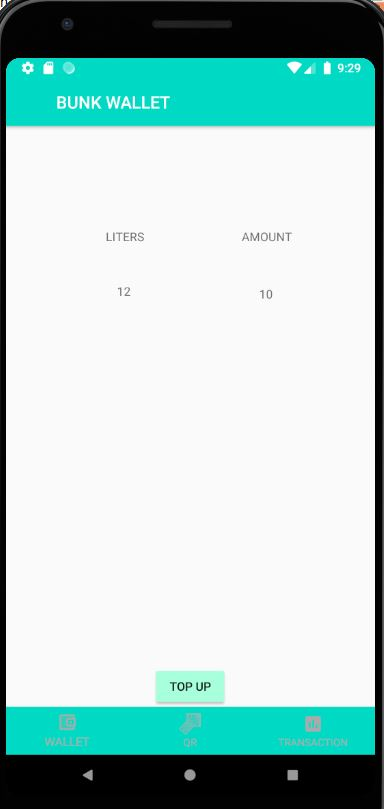
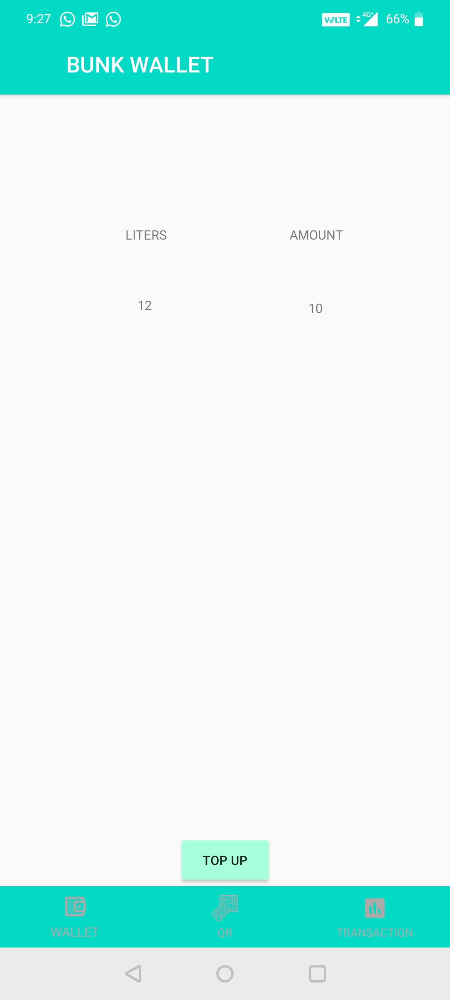
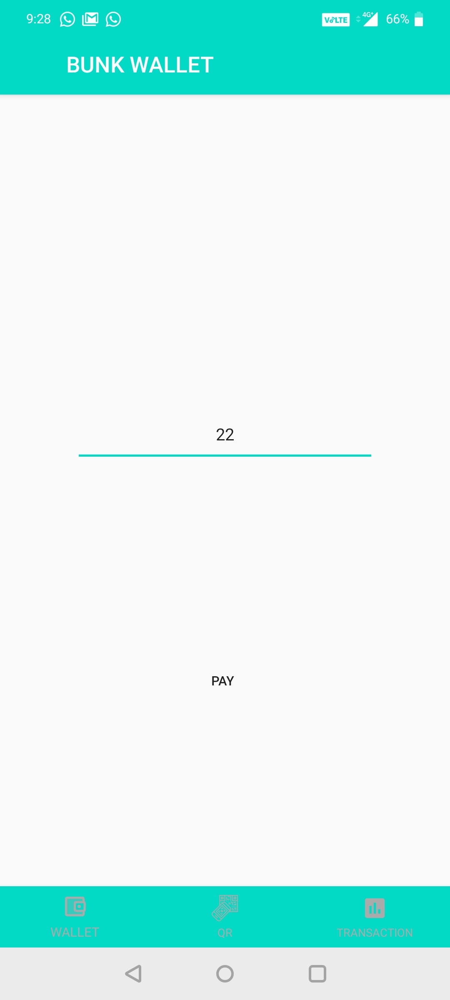
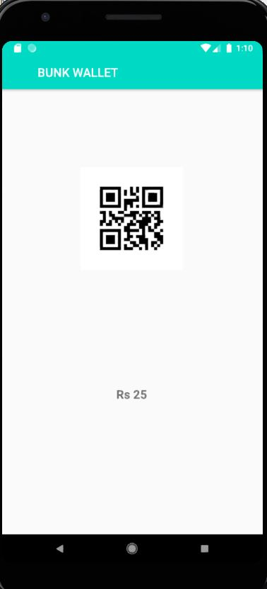
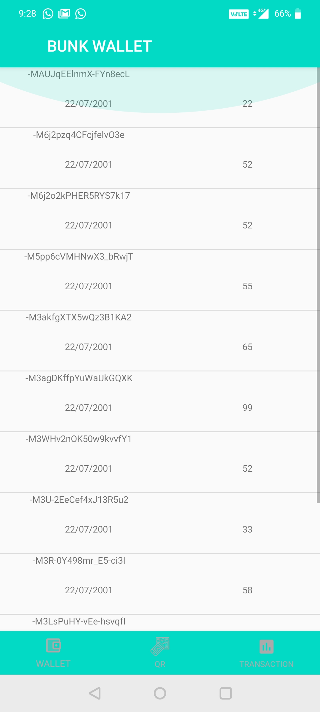
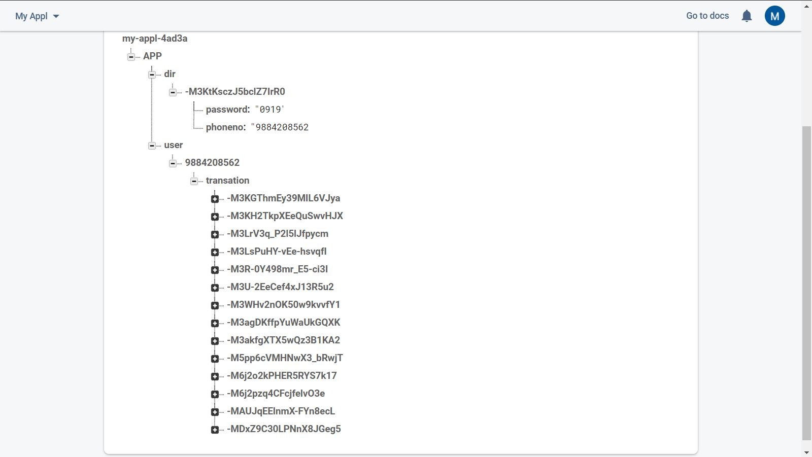

# FUEL WALLET
    I developed this product for a college subject this was for learning about documentaion of project 
    but i developed this for learning kotlin in practice.
## ABOUT THE PROJECT
This is a android application for user buy fuel virtually at affordable price and use it later for filling up the fuel 
This works like a wallet in offline mode with adequate measure of security.
I developed this app as a win- win model for both users and business owners.
## IMAGE ON THE WORKING OF APP :
    The application is for generally covering all the topic to undertand the concept.
This is firebase connected application for authentication and storing data of user.
and pretty basic application of tool in it. 

